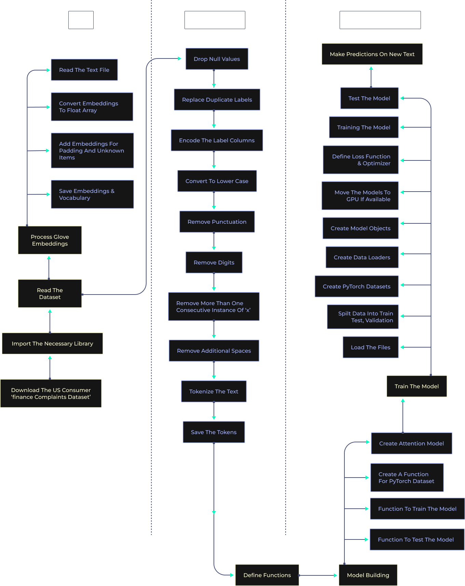

<<<<<<< HEAD
=======
# Text-Classification-Model-with-NLP-Attention-Mechanism-NLP
To carry out multiclass text classification on the dataset using an attention mechanism.


# Text Classification Model with NLP Attention Mechanism

This project implements a multiclass text classification model using an attention mechanism in Natural Language Processing (NLP).

## Project Structure

```bash
Text-Classification-Model-with-NLP-Attention-Mechanism-NLP/
│
├── Input/
│   ├── .ds_store
│   ├── complaints.csv           # Dataset (text data for classification)
│   ├── glove.6b.50d             # GloVe word embeddings (50-dimensional)
│
├── Output/
│   ├── vocabulary.pkl           # Saved vocabulary from training data
│   ├── tokens.pkl               # Tokenized text data
│   ├── labels.pkl               # Encoded labels
│   ├── label_encoder.pkl        # Label encoder used to convert labels to numbers
│   ├── embeddings.pkl           # Preprocessed word embeddings
│   ├── attention.pth            # Trained model weights with attention mechanism
│   ├── .ds_store
│
├── Source/
│   ├── .ds_store
│   ├── data.py                  # Data loading and processing
│   ├── model.py                 # Model architecture with attention mechanism
│   ├── utils.py                 # Utility functions for training and evaluation
│
├── attention                    # Script for attention mechanism (details unknown)
├── config.py                    # Configuration file (e.g., hyperparameters, paths)
├── engine.py                    # Training and evaluation logic (engine)
├── predict.py                   # Prediction script for new data
├── processing.py                # Data preprocessing (tokenization, cleaning, etc.)
├── readme                       # Documentation for the project (this file)


>>>>>>> 6d86bd78d92f4032fea57c9e0911875adc55ece5
# Text Classification using Attention Mechanism
This repository contains the code for text classification using attention model and glove pre-trained vectors.



### Installation
To install the dependencies run:
```buildoutcfg
pip install -r requirements.txt
```

### Dataset
The [dataset](https://catalog.data.gov/dataset/consumer-complaint-database) is a collection of complaints about consumer financial products and services that we sent to companies for response. The actual text of the compalint by the consumer is given in the `Consumer complaint narrative` column. The dataset also has a `product` column which contains the product for which the consumer is raising the complaint. We are going to build a model to predict the product given the complaint text. 

### Preprocessing the data
To pre-process the data and the embeddings, run:
```buildoutcfg
python precessing.py
```

### Train the model
To train the model, run:
```buildoutcfg
python Engine.py 
```

### Predictions
To make prediction on a new review, run:
```buildoutcfg
python predict.py --test_complaint "I am a victim of Identity Theft & currently have an Experian account that I can view my Experian Credit Report and getting notified when there is activity on my Experian Credit Report. For the past 3 days I've spent a total of approximately 9 hours on the phone with Experian. Every time I call I get transferred repeatedly and then my last transfer and automated message states to press 1 and leave a message and someone would call me. Every time I press 1 I get an automatic message stating than you before I even leave a message and get disconnected. I call Experian again, explain what is happening and the process begins again with the same end result. I was trying to have this issue attended and resolved informally but I give up after 9 hours. There are hard hit inquiries on my Experian Credit Report that are fraud, I didn't authorize, or recall and I respectfully request that Experian remove the hard hit inquiries immediately just like they've done in the past when I was able to speak to a live Experian representative in the United States. The following are the hard hit inquiries : BK OF XXXX XX/XX/XXXX XXXX XXXX XXXX  XX/XX/XXXX XXXX  XXXX XXXX  XX/XX/XXXX XXXX  XX/XX/XXXX XXXX  XXXX XX/XX/XXXX"
```
